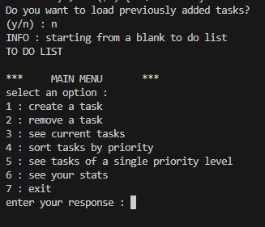
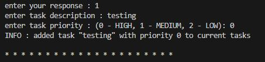
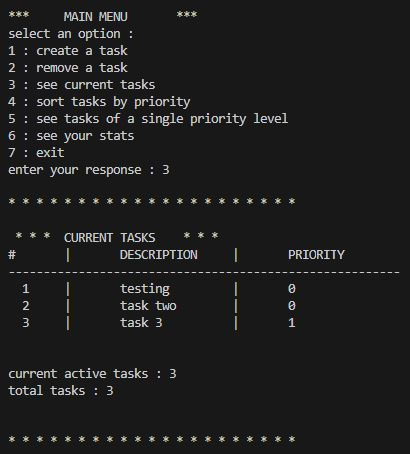
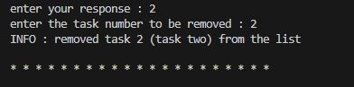
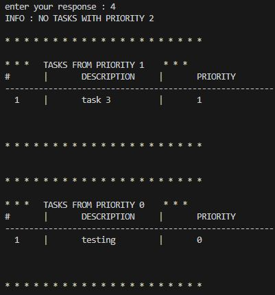
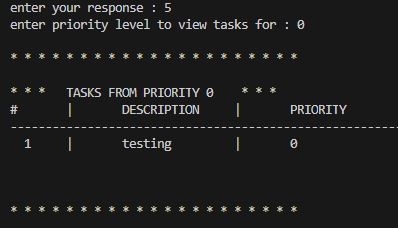
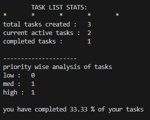
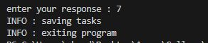
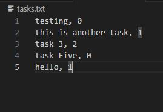
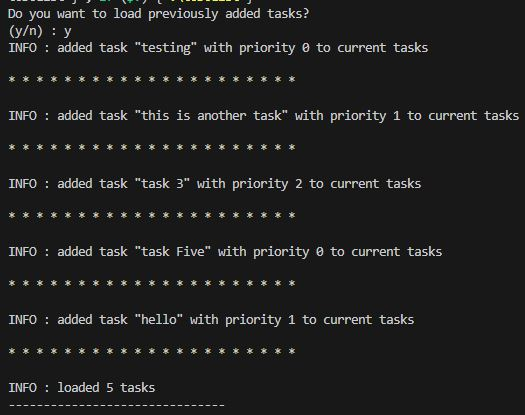

# demo
1. run the executable file
2. the CLI will open up with the main menu visible
3. feel free to try out the various options available
4. when quitting the program, the code saves your tasks in a task file that can be loaded up the next time you run the program once again

## screenshots
In this demo, we will be going through the entire application and try out all the available functionalities in the app

on starting the app, you will be asked if you want to load tasks from previous run, since this is our first time running the program, we should go with entering 'n' (you can try running 'y' as well but that will return in an error and the app will proceed with a fresh list only)

next, we will be greeted with the main menu and we'll be prompted to enter our response

we can write in a description for the task and assign a priority value to the task

the code will notify that the task has been added to the current tasks list

next, we can view the tasks in our list

this displays the tasks with an id, along with their priority level specified

lets say you are now done with a certain task, you can then remove it using command number 2 `remove a task`.

this will remove the task from the your current list of active tasks (here's something that you can check : try running display tasks again to see count of active tasks and total tasks)

you can also view tasks according to their priority level, the tasks are printed from priority 2 (LOW) to priority 0 (HIGH)

the user can also view tasks for any single priority as well as shown below

the user can also view their stats for tasks completed and the priority-wise task division

before exiting, the program saves the currently active tasks in a `.txt` file which can be loaded later if required by the user

this is what the program saves in the `.txt` file. The text before the comma delimiter is the task description and the number is the priority level of that task

now that we load the program again, we are asked if we want to load previously added tasks, where we now enter `y`

this adds the tasks to the current task list in the program which can be used by the user

---